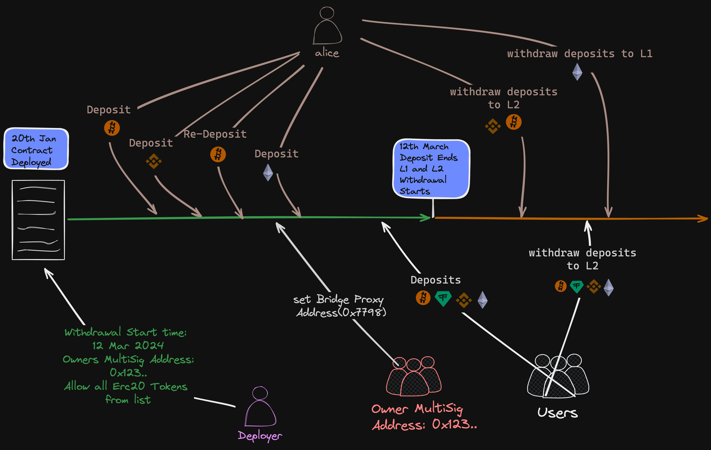
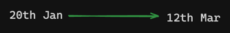

# FusionLock

## Index

1. [Introduction](#introduction)
2. [Installation](#installation)
3. [Testing](#testing)
4. [Contract Requirements](#contract-requirements)
5. [Flow Diagram](#flow-diagram)
6. [Security Considerations](#security-considerations)
7. [Contract Docs](#contract-docs)
8. [Deployment Script](#deployment-script)
9. [External Dependencies](#external-dependencies)
10. [References](#references)

## Introduction

The FusionLock contract enables users to deposit ERC20 tokens and Ether for a specified period. Once the withdrawal term starts, users can bridge their funds to Layer 2 or withdraw on Layer 1. The contract supports pausing functionality and grants the owner the ability to manage withdrawal start times, as well as token allowances.

## Installation

Prerequisite:  [foundry](https://book.getfoundry.sh/getting-started/installation) needs to be installed.

```shell
git clone --recurse-submodules https://github.com/bob-collective/fusion-lock.git
cd fusion-lock/
forge build
```

## Testing

- Fuzz testing and unit testing have been done for contract functionality and can be found in the test folder.
- To run tests use the following forge command:

```shell
forge test
```

[Slither Static Analyzer](https://book.getfoundry.sh/config/static-analyzers#slither)

- To run slither static analyzer with the script, [conda](https://pypi.org/project/conda/) needs to be pre-installed along with python version `3.11.6`.
- Command to run the script, the output will be displayed in terminal:

```shell
chmod +x automated-test/slither.sh
```

[Mythril Static Analyzer](https://book.getfoundry.sh/config/static-analyzers#mythril)

- To run mythril static analyzer with the script, [conda](https://pypi.org/project/conda/) needs to be pre-installed along with python version `3.11.6`.
- Command to run the script, the output will be displayed in terminal:

```shell
chmod +x automated-test/mythril.sh
```

## Contract Requirements

These are the requirements on which the smart contract is designed.

**For Owner:**
- The owner of the FusionLock contract will be a [Safe multisig](https://safe.global/).
- The owner can pause and resume all user functionalities.
- The owner can reduce `withdrawalStartTime`.
- The owner can modify the global `bridgeProxyAddress`.
- The owner can set a L1 bridge override for any of the allowed tokens.
- The owner can modify the `l2TokenAddress`, which is mapped to the `l1TokenAddress`.
- The owner can allow deposits of any ERC20 token. The ones that are planned for use are listed [in the deployment script](./deploy-contract.sh). For convenience, the tokens are also listed below, but the script is considered the source of truth.
- If the contract contains higher ERC20 token amounts than have deposited (e.g. if [bridging were to fail](https://github.com/ethereum-optimism/optimism/blob/3a62bccd6c5464891d0d6282264022d240d05b60/packages/contracts-bedrock/contracts/universal/StandardBridge.sol#L172), then the owner can withdraw the tokens to a specified address. This is an extra precaution against tokens getting stuck in the contract.

| Token Name | Token Address                                                                                                        |
|------------|----------------------------------------------------------------------------------------------------------------------|
| wstETH     | [0x7f39c581f595b53c5cb19bd0b3f8da6c935e2ca0](https://etherscan.io/token/0x7f39c581f595b53c5cb19bd0b3f8da6c935e2ca0)  |
| rETH       | [0xae78736cd615f374d3085123a210448e74fc6393](https://etherscan.io/token/0xae78736cd615f374d3085123a210448e74fc6393)  |
| wETH       | [0xc02aaa39b223fe8d0a0e5c4f27ead9083c756cc2](https://etherscan.io/token/0xc02aaa39b223fe8d0a0e5c4f27ead9083c756cc2)  |
| tBTC (v2)  | [0x18084fba666a33d37592fa2633fd49a74dd93a88](https://etherscan.io/token/0x18084fba666a33d37592fa2633fd49a74dd93a88)  |
| wBTC       | [0x2260fac5e5542a773aa44fbcfedf7c193bc2c599](https://etherscan.io/token/0x2260fac5e5542a773aa44fbcfedf7c193bc2c599)  |
| USDT       | [0xdac17f958d2ee523a2206206994597c13d831ec7](https://etherscan.io/token/0xdac17f958d2ee523a2206206994597c13d831ec7)  |
| USDC       | [0xa0b86991c6218b36c1d19d4a2e9eb0ce3606eb48](https://etherscan.io/token/0xa0b86991c6218b36c1d19d4a2e9eb0ce3606eb48)  |
| DAI        | [0x6b175474e89094c44da98b954eedeac495271d0f](https://etherscan.io/token/0x6b175474e89094c44da98b954eedeac495271d0f)  |
| USDe       | [0x4c9edd5852cd905f086c759e8383e09bff1e68b3](https://etherscan.io/address/0x4c9edd5852cd905f086c759e8383e09bff1e68b3) |
| eDLLR      | [0xbdbb63f938c8961af31ead3deba5c96e6a323dd1](https://etherscan.io/address/0xbdbb63f938c8961af31ead3deba5c96e6a323dd1) |
| eSOV       | [0xbdab72602e9ad40fc6a6852caf43258113b8f7a5](https://etherscan.io/token/0xbdab72602e9ad40fc6a6852caf43258113b8f7a5)  |
| ARB        | [0xB50721BCf8d664c30412Cfbc6cf7a15145234ad1](https://etherscan.io/token/0xB50721BCf8d664c30412Cfbc6cf7a15145234ad1)  |

**For User:**
- The user locks funds within the contract through a deposit.
- The user is allowed to make multiple deposits; redeposits are permitted.
- All users will be able to bridge to L2 if the current block timestamp is greater than or equal to
  - `withdrawalStartTime`
- All users will be able to withdraw to L1 if the current block timestamp is greater than or equal to
  - `withdrawalStartTime`

**Note:**
- Only one user functionality is active at any given time, either deposit or withdraw.
- The native token ETH is allowed to be deposited by default.

## Flow Diagram



The flow diagram illustrates an example contract timeline.

Note: All timestamps are provided for reference; different timestamps will be used during deployment.

**Operations Allowed in Timeframes**

The following **owner operations** are allowed at any time:
- Can pause user functionality.
- Can set global bridge proxy address
- Can change the L2 address of any token. 
- Can set a L1 bridge override for any token.

_1) During deposit_



**For Owner:**
- Can allow deposits of any ERC20 tokens, ideally taken from a list.
- Can reduce the withdrawal start time.

**For User:**
- Deposit for ETH and ERC20 tokens allowed.

_2) After withdrawal starts_


**For User:**
- Withdrawal on Layer 1 for ETH and ERC20 tokens allowed.
- Withdrawal on Layer 2 for ETH and ERC20 tokens allowed.

## Security Considerations

- Dependency on the owner to act rationally as it holds power to stop most user functionality. However, the owner can't pause withdrawals to L1 or transfer user funds.
- The owner is trusted to set valid bridge proxy address, as well as valid L2 token addresses.
- `block.timestamp` used extensively in the contract, knowing the limitation discussed in [yellow paper](https://neptunemutual.com/blog/understanding-block-timestamp-manipulation/). As it is the best approach.
- All the funds are held in a smart contract; a user contract wallet design was discussed by the team but skipped due to the issues discussed [here](https://github.com/bob-collective/FusionLock/issues/1#issuecomment-1948546205)
- If bridging fails, then the owner can withdraw the ERC20 tokens involved to an arbitrary account. The owner is trusted to refund the tokens to the user if this were to happen. Solutions requiring less trust are possible, but would increase the complexity of the contract too much.

## Contract Docs

- [NatSpec format](https://docs.soliditylang.org/en/latest/natspec-format.html) is used to write the contract documentation.
- To generate and build a markdown book for the contract, use the following command:

```sh
forge doc --serve
```

## Deployment Script
- Before running the deployment script, ensure the [environment variables](./deploy-contract.sh) are correctly set:
```shell
git clone --recurse-submodules https://github.com/bob-collective/fusion-lock.git
cd fusion-lock/
./deploy-contract.sh
```

## External Dependencies
- [Foundry](https://github.com/foundry-rs/foundry)
- [Open Zeppelin v5.0.1](https://github.com/OpenZeppelin/openzeppelin-contracts/releases/tag/v5.0.1)

## References
- [Github Issue](https://github.com/bob-collective/tasks/issues/3)

## Build on Bitcoin

BOB is a Bitcoin-augmented rollup bringing experimentation and freedom of choice to builders to make a real-world impact. BOB's vision is to onboard the next billion users to Bitcoin.

## Learn more

- [Website](https://www.gobob.xyz/)
- [Docs](https://docs.gobob.xyz/)
- [BOB Repository](https://github.com/bob-collective/bob)